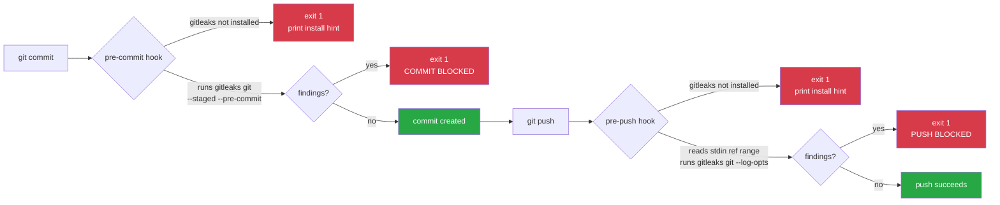

# Secret Scanning Architecture — gitleaks Git Hooks

## Executive Summary

Secrets (API keys, tokens, credentials) committed to a GitOps repository are high-severity incidents: the repo is the source of truth for cluster state and is synced continuously by ArgoCD. This setup uses gitleaks — a fast, rule-based secret scanner — as git hooks to intercept secrets at the earliest point in the workflow: before a commit lands locally and before a push reaches the remote. The hooks are deployed at two scopes: globally (all repos on this machine) and per-repo (travels with the codebase for other contributors). Client-side hooks are the fast local gate; the CI pipeline (Phase 2) is the unbypassable backstop — `git commit --no-verify` can always skip client hooks.

---

## Hook Flow

---

## Component Breakdown

| Component | Location | Purpose |
|---|---|---|
| `pre-commit` hook | `.githooks/pre-commit` | Scans staged changes before each commit |
| `pre-push` hook | `.githooks/pre-push` | Scans outgoing commits before each push |
| `setup.sh` | `.githooks/setup.sh` | Wires repo-local `core.hooksPath` |
| `install-global-hooks.sh` | `scripts/install-global-hooks.sh` | Installs hooks + sets global `core.hooksPath` |
| gitleaks binary | `$PATH` (user-installed) | Performs the actual secret detection |
| `.gitleaks.toml` (optional) | repo root | Custom rules, allowlists, false-positive suppression |

---

## Data Flow

1. **Staging** — developer runs `git add`. Staged content lives in the git index.
2. **Commit** — git invokes `.githooks/pre-commit`. The hook calls `gitleaks git --pre-commit --staged`, which reads directly from the git index (no filesystem writes). If gitleaks exits non-zero, the hook exits 1 and git aborts the commit.
3. **Push** — git invokes `.githooks/pre-push`, piping the pushed ref ranges to stdin. For each range `REMOTE_SHA..LOCAL_SHA`, the hook calls `gitleaks git --log-opts` to scan only the new commits. If any scan exits non-zero, the hook exits 1 and git aborts the push.
4. **False positives** — the developer adds an inline `# gitleaks:allow` comment or an `[allowlist]` entry in `.gitleaks.toml`, then re-commits.

---

## Key Principles

1. **Fail closed.** If gitleaks is not installed, both hooks exit 1 with an install hint. Missing tooling is not a silent pass.
2. **Scan the minimal surface.** `pre-commit` scans only staged changes; `pre-push` scans only the range of commits not yet on the remote. This keeps hook latency low.
3. **Redact output.** `--redact` prevents the actual secret value from appearing in terminal output or CI logs.
4. **No client-side bypass mechanism.** The hooks contain no `SKIP_GITLEAKS=1` or similar escape hatch. That said, `git commit --no-verify` / `git push --no-verify` are git built-ins that skip all client hooks — this is a git design constraint, not a hook limitation. The CI stage (Phase 2) provides the enforced backstop.
5. **Dual scope.** Global hooks (`~/.config/git/hooks/`) protect all repos on this machine without any per-repo action. The per-repo `.githooks/` directory makes the setup portable for contributors cloning the repo fresh.
