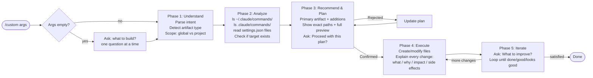

# Custom Skill — Architecture

The `/custom` command is a global Claude Code slash command that acts as a universal builder for any Claude Code customization artifact: skills, hooks, settings, agents, and CLAUDE.md sections. It follows a structured 5-phase workflow that inspects the current environment, shows a concrete plan before making any changes, and iterates until the user is satisfied. It is intentionally self-contained so it can be followed by any Claude instance without external context.

## Workflow Diagram

## Phase-by-Phase Description

### Phase 1 — Understand
Parses `$ARGUMENTS` to determine what artifact type to build, where it should live (global vs project scope), and what behavior the user wants. If arguments are empty, asks one open question. If the intent is ambiguous, asks one targeted clarifying question. Does not proceed until intent is clear.

### Phase 2 — Analyze Current State
Runs actual shell reads to inspect the live environment: lists existing global and project skills, reads all settings files (global, project, local), and checks whether the target file already exists. Surfaces findings in a brief structured summary before making any recommendations.

### Phase 3 — Recommend and Plan
Proposes the primary artifact plus any high-value additions. Shows the **exact file paths** and a **full draft or diff** of content before any file is touched. Waits for explicit user confirmation ("Proceed with this plan?"). If the user wants changes, the plan is revised and confirmed again.

### Phase 4 — Execute
Creates or modifies files only after confirmation. For each file touched, explains what was added/removed/modified, why, the behavioral impact, and any side effects. No silent changes — every modification is accounted for.

### Phase 5 — Iterate
Asks "What would you like to improve?" and loops with the same level of detail until the user explicitly signals they are done.

## Artifact Type Detection

| User says / implies | Artifact type | Typical location |
|---|---|---|
| "command", "skill", "slash command", "/foo" | Skill (.md) | `commands/<name>.md` |
| "hook", "run X when", "before/after tool", "on stop" | Hook (settings.json) | `settings.json` hooks section |
| "allow", "permission", "setting", "enable/disable" | Settings change | `settings.json` |
| "agent", "subagent", "delegate to" | Agent config | `agents/<name>.md` |
| "CLAUDE.md", "project instructions", "add guidance" | CLAUDE.md section | `CLAUDE.md` |
| Complex multi-concern request | Combination | Multiple files |

Scope defaults to **project** (`.claude/`) for project-specific customizations and **global** (`~/.claude/`) when the customization should apply everywhere.

## Key Design Principles

**Inspect before recommending.** Phase 2 reads the live environment before suggesting anything. This prevents recommending a skill name that already exists, overwriting a hook that is already configured, or proposing a settings change that is already in effect.

**Preview before execute.** No file is touched until the user has seen and approved the exact content. This follows the same principle as the existing `fix` and `architect` skills: get confirmation before action.

**Explain every change.** Satisfies the global preference (in `~/.claude/CLAUDE.md`) that every code change is explained in detail — what, why, impact, and side effects.

**Self-contained.** The skill file carries all context needed for execution. Future Claude instances following it do not need to recall this conversation, read this README, or consult external docs.

**Single entry point.** One `/custom` command handles all artifact types through detection logic, rather than requiring the user to know and choose between `/custom-skill`, `/custom-hook`, etc.
