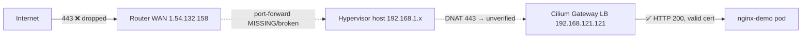

# Incident: nginx-demo.chillpickle.org unreachable from internet

**Date**: 2026-06-11 | **Status**: RESOLVED as diagnosis — site is UP globally; unreachability is
source-specific carrier routing between the testing network and the home IP. Stack is healthy.

> **Final diagnosis (read this first):** `check-host.net` returned **HTTP 200 from India, Poland, Turkey**,
> and nginx logs show internet scanners reaching the proxy continuously. The entire chain
> (DNS → DDNS → router DMZ → `lacia-dmz-proxy` nginx → Cilium Gateway → pod) is **working**.
> The only break: packets from the user's current network (egress `183.81.8.225`) die ~hop 10 **inside the
> FPT carrier network** and never reach `1.54.132.158` — an intra-ISP routing blackhole between two
> dynamic-pool endpoints (both networks traverse the same pools: 113.22.x / 118.68.x / 42.114.x).
> Nothing in this repo or on the home network was at fault.
> **Fix**: enable Cloudflare proxy (orange cloud, `PROXIED=true` in cloudflare-ddns values) so clients hit
> CF's edge instead of the home IP directly. Admin paths (kubectl/SSH) unaffected — they ride Tailscale.
>
> **Nginx log gotcha** (`recv() failed ... reset by peer, bytes to client:0`): these are Envoy *correctly
> resetting* clients with missing/unknown SNI (bare-IP scanners, plain-HTTP tests) — not an upstream failure.

---

The sections below are the investigation as it unfolded (kept for the learning value — several
intermediate hypotheses were later disproven).

## Symptom

`https://nginx-demo.chillpickle.org/` times out (TCP connect timeout, port 443).
All other `*.chillpickle.org` hosts behind the same Gateway are equally affected.

## Investigation (outside-in)

| # | Check | Result | Conclusion |
|---|---|---|---|
| 1 | `dig nginx-demo.chillpickle.org` | `1.54.132.158` | DNS resolves |
| 2 | `curl https://...` from remote network | TCP timeout on 443 | Failure is at network layer, not TLS/app |
| 3 | DDNS pod logs vs DNS record | Pod detects `1.54.132.158`, matches DNS | **DDNS is working** — updated correctly through 2 IP rotations (Jun 9 → `113.22.73.151`, Jun 10 → `1.54.132.158`, ~every 24h at ~19:00) |
| 4 | In-cluster: `curl --resolve nginx-demo...:443:192.168.121.121` | **HTTP 200**, valid LE cert `*.chillpickle.org` (exp 2026-08-25), server: envoy | **Cluster fully healthy**: Gateway, TLS, HTTPRoute, backend all OK |
| 5 | `mtr 1.54.132.158` from inside LAN | Answers at hop 3 (= router position), 1.9 ms | IP **is** on the router WAN — not CGNAT |
| 6 | External probe: ports 80/443/22/6443/8443 + ICMP | All dropped, total silence | Router/ISP drops **all** inbound on WAN |
| 7 | Hairpin test from LAN to WAN IP:443 | TCP connects, TLS handshake dies | Listener is router's own WAN-bound service, not the Gateway → no effective port-forward |
| 8 | LAN scan `192.168.1.0/24:443` from pod | Zero listeners | No live forward target on LAN either |

## Topology (for context)

- LB pool is `192.168.121.0/24` = **libvirt NAT network inside the hypervisor** — the router can never reach it directly; the chain depends on host-level DNAT.
- kubectl access from outside works only because `cp-node` is on Tailscale — unrelated to the broken HTTP path.

## Follow-up findings (with SSH access to lacia, 192.168.1.30)

The forwarding design is **not DNAT** — it's an nginx Docker container (`lacia-dmz-proxy`, host network)
stream-proxying 80/443 → Gateway. Router uses **DMZ → 192.168.1.30**.

| # | Check | Result |
|---|---|---|
| 9 | `docker ps` + `ss -tlnp` on lacia | `lacia-dmz-proxy` Up 2 weeks, nginx listening on 0.0.0.0:80/443 ✓ |
| 10 | nginx config | `proxy_pass 192.168.121.121:{80,443}` — already points at **current** Gateway IP ✓ |
| 11 | Hairpin test **with SNI** from inside: `curl --resolve nginx-demo...:443:1.54.132.158` | **HTTP 200, correct cert** — full chain router→nginx→Gateway→pod works ✓ |
| 12 | **tcpdump on lacia during external probes** (80/443/8443/22222/51820 + ICMP) | **Zero packets arrived** from the internet ❌ |

False leads eliminated along the way:
- Stale iptables DNAT/FORWARD rules for old Gateway IP `.200` in shell history/firewall = leftovers of an
  abandoned approach, not the active path.
- "TLS handshake failure" on bare-IP curls = missing **SNI** (Envoy needs SNI to select the wildcard cert),
  a test artifact, not a real fault. Always test with `curl --resolve host:443:IP https://host/`.

## Root cause

**Everything self-hosted is healthy and correctly configured** (DNS, DDNS, router DMZ hairpin, nginx proxy,
Gateway, cert, app — all verified end-to-end). The break is **upstream**: packets from the internet to
`1.54.132.158` are dropped before reaching the home — on any port, including ICMP — while the router
verifiably holds that IP on its WAN. Prime suspects:

1. **ISP-level inbound filtering** on the residential line (increasingly common in VN; the line also
   rotates IP daily ~19:00 across different ranges — consistent with a dynamic pool that may not accept
   unsolicited inbound).
2. Router **WAN-side firewall/ACL** dropping unsolicited traffic before the DMZ rule applies
   (hairpin/LAN-originated traffic can take a different path, so hairpin success doesn't fully clear the router).

## Resolution steps

1. Router (`192.168.1.1`): check WAN firewall / ACL / "block WAN ping" settings; temporarily lower
   firewall level and re-test from an external network.
2. If unchanged → ISP is filtering. Options: request a real/static public IP from the ISP, or stop
   depending on inbound entirely (below).

## Permanent fix (recommended)

The home IP rotates ~daily and the ISP/router inbound path is fragile. **Cloudflare Tunnel (`cloudflared`)**
removes the dependency entirely: outbound-only connection, no port-forwards, no DDNS race after IP changes,
and hides the home IP. Deployable as another app in this repo (Deployment + tunnel token via ESO/Infisical).

## Controlled experiment (k8s removed from the equation)

Swapped `lacia-dmz-proxy` for a vanilla `nginx:alpine` (host network, default config, port 80 only,
no forwarding to k8s) and tested the same URL from three vantage points simultaneously:

| Vantage point | Result |
|---|---|
| User's current network (laptop) | **TIMEOUT** — identical failure with zero k8s involvement |
| check-host.net (India, Iran, Romania) | **HTTP 200** (default nginx page) |
| Home LAN hairpin (pod → WAN IP) | **HTTP 200** |

This falsifies the "k8s upstream not responding" hypothesis conclusively: the failure pattern is
identical whether Kubernetes is in the path or not. The break is the carrier route between the
user's network and the home IP. Test container removed and `lacia-dmz-proxy` restored afterwards;
full HTTPS chain re-verified (200 via WAN IP with SNI).

## Lessons

- "Pod Running + ArgoCD Healthy" ≠ end-to-end reachable — the failure was outside the cluster's visibility.
- Diagnose outside-in: DNS → TCP → TLS → app; compare external vs in-cluster behavior to bisect the path.
- `mtr` to your own WAN IP from inside the LAN cheaply distinguishes "stale DNS / CGNAT" from "router drops inbound".
