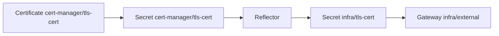

# TLS Certificate Reflector Migration

The cluster previously maintained two equivalent cert-manager `Certificate`
resources in `infra`: `tls-cert` and `wildcard-tls`. The shared Gateway consumed
`wildcard-tls`, while `tls-cert` was unused. The target design keeps one default
certificate in `cert-manager` and lets Reflector create explicitly allowed
namespace-local Secret copies.



## GitOps Ownership

`apps/infra.yaml` includes the Certificate and Gateway bootstrap files as exact
ArgoCD directory sources. After a change merges to `main`, the existing `infra`
Application applies and continuously reconciles both resources with automated
pruning and self-healing. Neighboring bootstrap secrets, issuers, and demo
resources are excluded.

The same files remain directly applicable during initial cluster bootstrap,
before ArgoCD is installed.

## Existing-Cluster Migration

Keep `infra/wildcard-tls` in place until the reflected replacement is ready so
the current Gateway continues terminating TLS throughout the transition.

```bash
# 1. Merge the change, wait for ArgoCD to create the source Certificate, and
#    confirm the infra app is synced.
kubectl wait -n argocd --for=jsonpath='{.status.sync.status}'=Synced \
  application/infra --timeout=5m
kubectl wait -n cert-manager --for=condition=Ready \
  certificate/tls-cert --timeout=10m

# 2. Remove the old, unused infra/tls-cert owner and Secret. Reflector cannot
#    create its same-named mirror while these objects exist.
kubectl delete certificate tls-cert -n infra --ignore-not-found
kubectl delete secret tls-cert -n infra --ignore-not-found

# 3. Wait for Reflector to create the replacement mirror.
kubectl wait -n infra --for=create secret/tls-cert --timeout=2m

# 4. Confirm the Argo-managed Gateway uses the reflected Secret successfully.
kubectl wait -n infra --for=condition=Programmed \
  gateway/external --timeout=5m

# 5. Retire the old Certificate and Secret after the Gateway is programmed.
kubectl delete certificate wildcard-tls -n infra --ignore-not-found
kubectl delete secret wildcard-tls -n infra --ignore-not-found
```

Confirm the source and mirror contain the same certificate fingerprint:

```bash
for namespace in cert-manager infra; do
  echo "=== ${namespace}/tls-cert ==="
  kubectl get secret tls-cert -n "${namespace}" \
    -o jsonpath='{.data.tls\.crt}' | base64 -d | \
    openssl x509 -noout -fingerprint -sha256 -ext subjectAltName
done
```

## Adding a Target Namespace

Add the namespace to both comma-separated annotation values in
`bootstrap/4.cert-manager/certificate.yml`:

```yaml
reflector.v1.k8s.emberstack.com/reflection-allowed-namespaces: infra,example
reflector.v1.k8s.emberstack.com/reflection-auto-namespaces: infra,example
```

Reflect only to namespaces with a workload that directly consumes the private
key. HTTPRoutes attached to the shared Gateway do not need a local TLS Secret.
